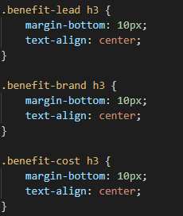
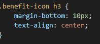

#<refactor-ticket-horiseon>

## Description-

This is my first refactor ticket.  It's for a social solutions company called Horiseon, and the code had quite a few errors.  Although the website runs fine at first glance, there were a number of issues with the formatting in both the HTML and CSS.  

Multiple elements in CSS were cloned when they could have been assigned to just one class, the accessibility was lacking in terms of alt tags for images, and semantically there were a lot of divs.  

First thing I did was added alt tags for every image.  It was the most noticeable issue and quickest fix.  In addition, I changed some elements like SEO from a class to an ID, and removed the IDs for two of the sections since they weren't anywhere in the CSS and didn't apply.  

There were also a lot of div tags in the HTML, and most of them did not make sense semantically.  I replaced them with sections and asides where necessary, but kept a couple that seemed to work.

Next item on my agenda was changing elements in CSS with similar parameters, and assigning them to one class.  I have attached an example of a before/after. 

Before.
 After 

I also tried to make the CSS elements as concise as possible.  For a couple elements including the header and footer, they had unnecessary parent/child elements which added many unnecessary lines of code.  As a result, I decided to combine them where I could.  All of my efforts trimmed down the CSS from originally 200 lines of code to 141.

The last thing I did was I ran the HTML through a valdiator to fix any small errors, and finally I deployed.  Horiseon now has a refactored code done by me.

## Contributors-
I did all of the editing but got some great help from my instructor John for clarification on the accessibility standards.

## Instructions-
Click on the link to view the website, then you can view the code by right clicking and selecting the Inspect tool.

## License-
2022 Matthew Carlson Code
